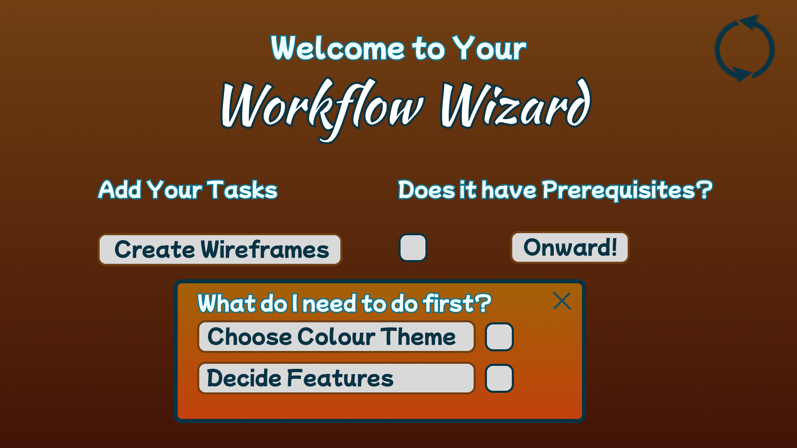

# 💡Inspiration
Often at times, knowing the order in which tasks need to be completed from TDL is hard as one cannot know which tasks are linked to others and only gets to realise the relationship after much time has been spent on a task only to find out that that task needed another task to be completed before doing it. The team saw this as an opportunity to create an application that allows the user to prioritise tasks in the order in which they need to be done.

# 🤔Purpose
The project serves as an efficient productivity tool that empowers users to input tasks, establish dependencies, and receive a streamlined recommended order for task completion, enhancing overall workflow efficiency.

# What it Does
Our project enhances productivity by allowing users to input their tasks. If a task is dependent on the completion of another task, users can specify these relationships. Once all tasks are entered, users simply click "Onward!" and the program generates a recommended task order based on dependencies.

# 🎨Design 
We were heavily inspired by the revised version of Double Diamond design process, which not only includes visual design, but a full-fledged research cycle in which you must discover and define your problem before tackling your solution & then finally deploy it.

> 1. Discover: a deep dive into the problem we are trying to solve.
> 2. Define: synthesizing the information from the discovery phase into a problem definition.
> 3. Develop: think up solutions to the problem.
> 4. Deliver: pick the best solution and build that.

The project was designed using Figma and below are some of the samples of how the screens would look like:

# ⚒️How We Built It 
The project was built using the following technologies:
- React
- Next.js 
- TailwindCSS

# 💫Proud Achievements 

# 😤Challenges Faced 

# 👐Insights 

# 🚀What's Next 
